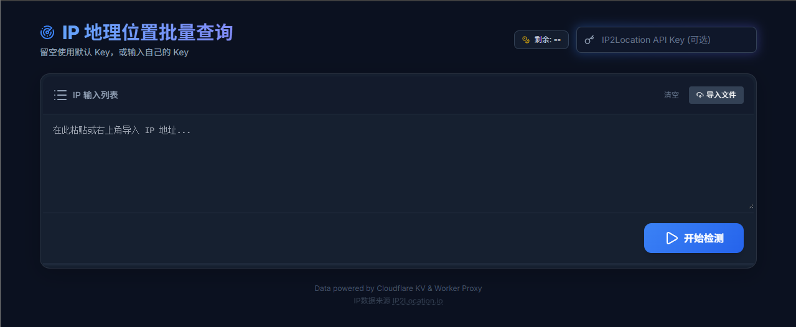
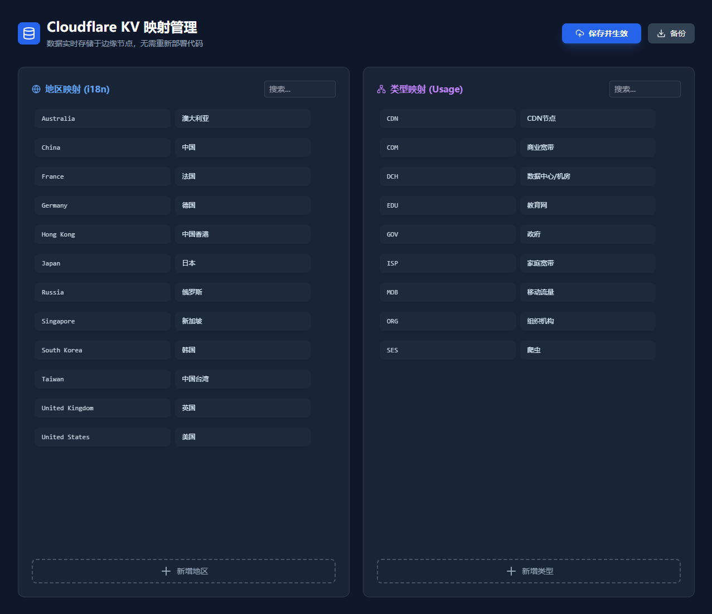

🌍 IP Batch Analyzer (Cloudflare Worker Edition)

这是一个基于 Cloudflare Workers 和 KV Storage 的 IP 批量检测工具。它支持批量查询 IP 地址的地理位置、ISP、代理状态等信息，并支持导出 Excel/CSV。
=

  <strong>在线体验:</strong> <a href="https://ip.li0il.ggff.net/">https://ip.li0il.ggff.net/</a>

  <strong>开源地址:</strong> <a href="https://github.com/maslast/IP-Geolocation-Lookup">https://github.com/maslast/IP-Geolocation-Lookup</a>

✨ 功能特性
-
* 🚀 端口完整保留：支持输入 1.1.1.1:8080 格式，在查询、显示、导出过程中全程保留端口号。

* 🌐 自动翻译代理：内置 Worker 后端翻译代理，解决国内环境无法直接请求 Google 翻译 API 的问题，实现地名自动中文化。

* 📊 交互式 UI：

  * 国家分组折叠：点击国家标题可展开或收起该组下的所有 IP。

  * 单击复制：在表格中点击任何 IP:端口 即可直接复制到剪贴板。

  * 响应式设计：完美适配手机与电脑端。

* 📂 文件导入与导出：
-
  * 支持直接拖入或选择 .txt / .csv 文件。

  * 支持一键导出结果至 Excel (.xlsx) 或 CSV 格式。

* 🛡️ 智能分类：
-
  * 自动识别并区分“直连”与“代理” IP。

  * 自动将港澳台归类至中国。

  * 智能去重重复的行政区划名称。

*🛠️ 部署指南
-
1. 准备工作

  * 拥有一个 Cloudflare 账号。

  * (可选) 注册 IP2Location.io 获取免费的 API Key (免费版每日支持 500 次查询)。

2. 部署步骤
-
  * 登录 Cloudflare 控制台，进入 Workers & Pages。

  * 点击 Create Application -> Create Worker。

  * 为你的 Worker 命名（例如 ip-tools），点击 Deploy。

  * 点击 Edit Code，将本项目的 worker.js 代码全文粘贴进去。

  * 点击 Save and Deploy。

3. 配置 API Key (可选但推荐)
-
  * 如果不配置 Key，将使用 IP2Location 的共享频率限制，可能导致查询失败。

  * 在 Worker 的控制面板中点击 Settings -> Variables。

  * 在 Environment Variables 处点击 Add variable。

  * 变量名填入：IP_API_KEY。

  * 值填入：你的 IP2Location API Key。

  * 点击 Save and deploy。

📖 使用说明
-
  * 输入数据：在文本框内直接粘贴包含 IP 的文本（程序会自动识别 IP 和端口），或点击“导入文件”上传。

  * 设置 Key：如果你没有在后台配置环境变量，可以在页面顶部的 API Key 输入框临时填入。

  * 开始检测：点击“开始检测”按钮，程序将以每组 5 个请求的并发速度进行查询。

  * 查看结果：

  * 点击国家标题行：展开或隐藏该国家的 IP 列表。

  * 点击IP 地址：提示“已复制”并自动复制到剪贴板。

  * 导出数据：点击统计面板右侧的“导出 Excel”或“导出 CSV”。

🧩 技术栈
-
Runtime: Cloudflare Workers (V8 Engine)

Frontend: HTML5, Tailwind CSS, JavaScript (ES6+)

Icons: Lucide Icons

Data Processing: SheetJS (XLSX)

APIs:

  * IP 数据: IP2Location.io

  * 翻译: Google Translate API (via Worker Proxy)

  * 国旗: Flagcdn

⚠️ 注意事项
=
  * 频率限制：IP2Location 免费版 API 有每日额度限制，请合理使用。

  * 隐私说明：本工具所有查询请求均通过 Cloudflare Worker 中转，不会在浏览器端暴露你的 API Key（如果已配置为环境变量）。

  * 浏览器兼容性：建议使用 Chrome、Edge 或 Safari 等现代浏览器，部分旧版浏览器可能不支持 navigator.clipboard 复制功能。

  * 如果您觉得好用，请给个 Star 吧！

